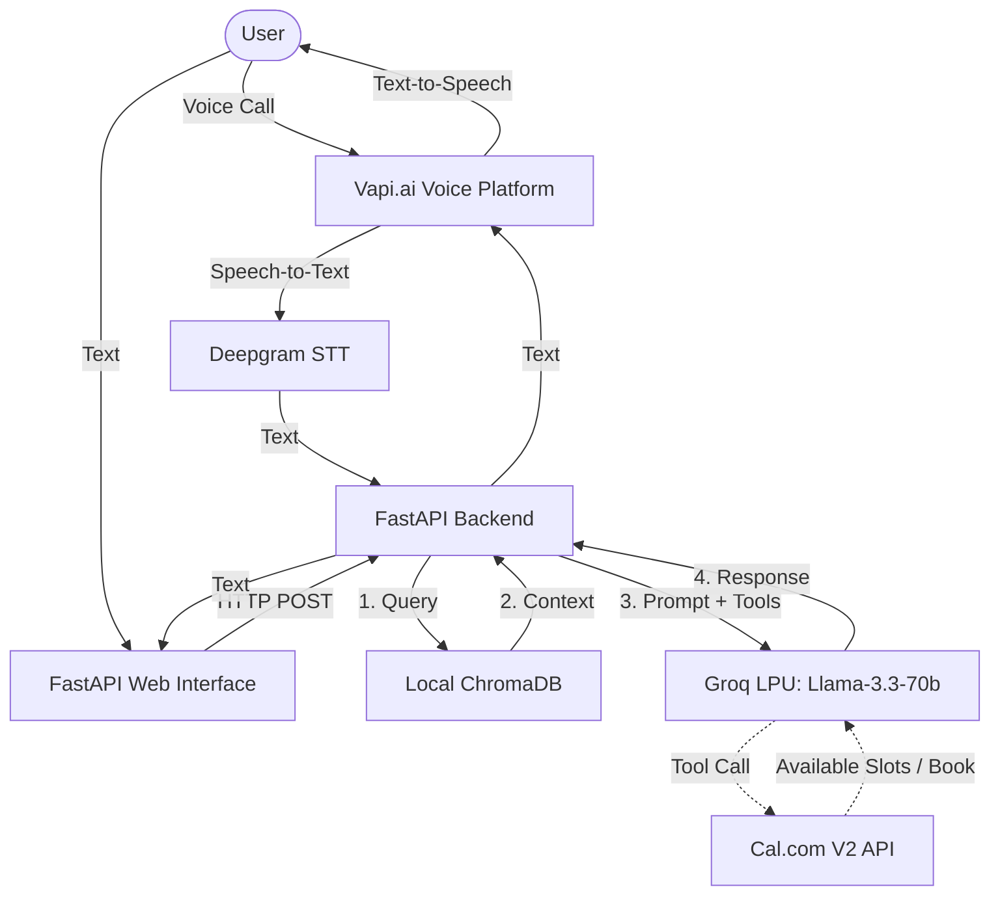

# Scaler AI Persona: Digital Twin

A conversational AI agent that acts as a digital twin for Sanjay Singh Rawat, capable of answering questions about his professional background, projects, and skills, as well as booking real-time calendar appointments. Accessible via both a Web Chat UI and a low-latency Voice interface (phone call).

## 🏗️ Architecture



## 🚀 Features
- **RAG Grounded:** Uses Google Gemini embeddings (`gemini-embedding-001`) and ChromaDB to search through a dynamically scraped corpus of the candidate's Resume and 20+ GitHub repositories. No hardcoded Q&A.
- **Ultra-Low Latency Voice:** Integrates with Vapi and Groq's Llama-3.3-70B model to achieve ~450ms first-response latency, fully supporting barge-ins and interruptions.
- **Real Calendar Booking:** Connects to Cal.com V2 API to check actual availability and instantly book calendar slots via LLM tool-calling.
- **Anti-Prompt Injection:** Strict negative constraints prevent the AI from breaking character, adopting new personas (e.g., pirate mode), or hallucinating fake experience.

## 🛠️ Setup Instructions

### 1. Prerequisites
- Python 3.10+
- [Groq API Key](https://console.groq.com/) (For Llama-3.3-70b LLM)
- [Google Gemini API Key](https://aistudio.google.com/) (For Embeddings)
- [Cal.com API Key & Event Type ID](https://cal.com/) (For Bookings)
- [Vapi.ai Account](https://vapi.ai/) (For Voice interface)

### 2. Installation
```bash
# Clone the repository
git clone https://github.com/sanjayrawatt/scaler-ai-persona.git
cd scaler-ai-persona

# Create a virtual environment and install dependencies
python -m venv venv
source venv/bin/activate
pip install -r requirements.txt
```

### 3. Environment Variables
Create a `.env` file in the root directory:
```env
GROQ_API_KEY=your_groq_key
GOOGLE_API_KEY=your_gemini_key
CAL_API_KEY=your_cal_com_key
CAL_EVENT_TYPE_ID=your_event_id
```

### 4. Build the RAG Knowledge Base
Ensure your resume PDF is in the `data/` folder, then run the indexer to scrape GitHub and build the ChromaDB vector index:
```bash
python src/rag.py
```

### 5. Run the Server
```bash
uvicorn src.main:app --reload
```
The Web Chat UI will be available at `http://localhost:8000/static/index.html`. 
For Vapi Voice integration, expose the local server using `ngrok http 8000` and paste the URL into your Vapi Custom LLM Server URL configuration.

## 💸 Cost Breakdown

### Per Voice Call
- **Vapi.ai (Voice/Routing):** ~$0.05 / minute
- **Deepgram (STT):** Included in Vapi / Free Tier
- **Groq (Llama-3.3-70b):** $0.00 (Free Tier - 100k tokens/day)
- **Cal.com (Booking):** $0.00 (Free Tier)
- **Total:** ~$0.05 per minute of active voice conversation.

### Per Chat Session (Web)
- **Groq (Llama-3.3-70b):** $0.00 (Free Tier)
- **Total:** $0.00 (Completely free under 100k tokens/day limit).
